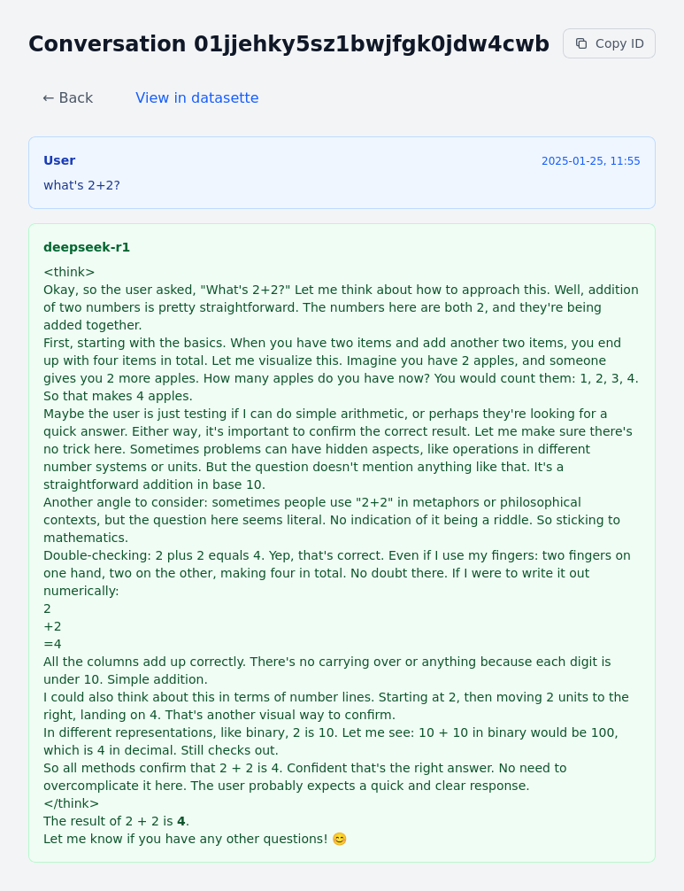

# LLM Conversation Viewer

A web-based viewer for browsing conversation logs from the `llm` command line utility, built with Datasette.

## Overview

This tool provides a user-friendly interface to view and navigate through your LLM conversation history stored by the `llm` CLI tool. It uses Datasette to serve the SQLite database containing your conversation logs.



## Prerequisites

- Python 3.x
- [llm](https://llm.datasette.io/) CLI tool installed and configured
- [uv](https://github.com/astral-sh/uv) package manager

## Installation

1. Clone this repository:
   ```bash
   git clone https://github.com/datakami/datasette-conversation-viewer.git
   cd datasette-conversation-viewer
   ```

2. Make sure the run script is executable:
   ```bash
   chmod +x run.sh
   ```

## Usage

Start the viewer by running:

```bash
./run.sh
```

This will:
1. Locate your llm logs database
2. Start a Datasette instance with the necessary plugins
3. Serve the conversation viewer interface

By default, the server will be available at `http://localhost:8001`

## Features

- View all LLM conversations in a clean, web-based interface
- Navigate through conversation history
- Markdown rendering support
- Custom templates for improved readability

## Dependencies

The following Datasette plugins are automatically fetched by uv:
- datasette-template-sql
- datasette-render-markdown
- py-gfm (Python GitHub-Flavored Markdown)

## License

MIT License - See LICENSE file for details

## Contributing

Contributions are welcome! Please feel free to submit a Pull Request.

## Support

For issues and feature requests, please open an issue on the GitHub repository.
